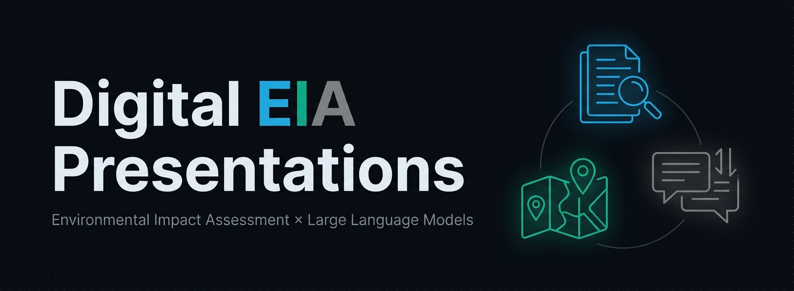

<div align="center">
  
</div>

<br>

A collection of bilingual presentations (Korean · Uzbek) on the **digital transformation of Environmental Impact Assessment (EIA)**, covering global policy trends, national systems, and the emerging role of Large Language Models in environmental review.

## Live Demo

Open the landing page and pick a presentation, or click a title below to launch it directly in fullscreen.

**Landing page**: [https://kkhgeo.github.io/digital-eia-kr/](https://kkhgeo.github.io/digital-eia-kr/)

### Presentations

**1. Digital EIA: Global Trends and Future Directions** (~20 min)
Overview of digital transformation in EIA: global policy trends (US, EU, Canada, Australia), Korea's EIASS system, and strategic directions for the next decade.

- [Korean version](https://kkhgeo.github.io/digital-eia-kr/?v=digital-eia-kr)
- [Uzbek version](https://kkhgeo.github.io/digital-eia-kr/?v=digital-eia-uz)

**2. LLMs in Environmental Impact Assessment** (~15 min)
Deep dive on Large Language Model adoption in environmental review, based on the US PermitAI initiative (PNNL), NEPAQuAD and MAPLE benchmarks, and a synthesis of recent peer-reviewed research.

- [Korean version](https://kkhgeo.github.io/digital-eia-kr/?v=llm-eia-kr)
- [Uzbek version](https://kkhgeo.github.io/digital-eia-kr/?v=llm-eia-uz)

Higher-bitrate versions of Presentation 2 are distributed via [Release v1.0](https://github.com/kkhgeo/digital-eia-kr/releases/tag/v1.0); Presentation 1 files are served directly from GitHub Pages.

## Related Resource

**[http://snailss.ddns.net:6001/](http://snailss.ddns.net:6001/)** — companion interactive site for the presentations.

## Keyboard Shortcuts

| Key | Action |
|-----|--------|
| `Space` | Play / Pause |
| `F` | Toggle fullscreen |
| `ESC` | Exit fullscreen / Return to menu |
| `->` `<-` | Skip 5 seconds forward / backward |
| `M` | Mute / Unmute |

## Offline Playback

For venues with unreliable internet, the entire landing page runs locally without any server. Simply download this repository and open `index.html` in any modern browser. Presentation 1 videos are included in the repo; Presentation 2 videos should be downloaded from the [Release page](https://github.com/kkhgeo/digital-eia-kr/releases/tag/v1.0) and placed next to `index.html`.

```bash
git clone https://github.com/kkhgeo/digital-eia-kr.git
cd digital-eia-kr
# Download full-length videos from Release v1.0 if offline playback of Presentation 2 is needed
# Double-click index.html to open in your default browser
```

All keyboard shortcuts and the selection UI work identically offline.

## Browser Compatibility

Tested on:
- Google Chrome (recommended)
- Microsoft Edge
- Mozilla Firefox
- Safari

The fullscreen API requires a user gesture (card click), so fullscreen activates on the first interaction — this is standard browser behavior.

## Repository Structure

```
digital-eia-kr/
├── index.html                          # Landing page with presentation selector
├── banner.png                          # README hero banner
├── Digital_EIA_Presentation_kr.mp4     # Presentation 1 — Korean
├── Digital_EIA_Presentation_uz.mp4     # Presentation 1 — Uzbek
└── README.md

Release v1.0 assets:
├── LLM_EIA_video_ko.mp4                # Presentation 2 — Korean
└── LLM_EIA_video_uz.mp4                # Presentation 2 — Uzbek
```

## Design

The landing page follows a minimal dark-mode aesthetic with a fluorescent yellow-green accent (`#c6ff00`), optimized for projector display in darkened conference rooms.

## License

Presentation content © 2026 KKH Research. Video files are provided for demonstration and educational purposes.

## Contact

Maintained by [@kkhgeo](https://github.com/kkhgeo).
